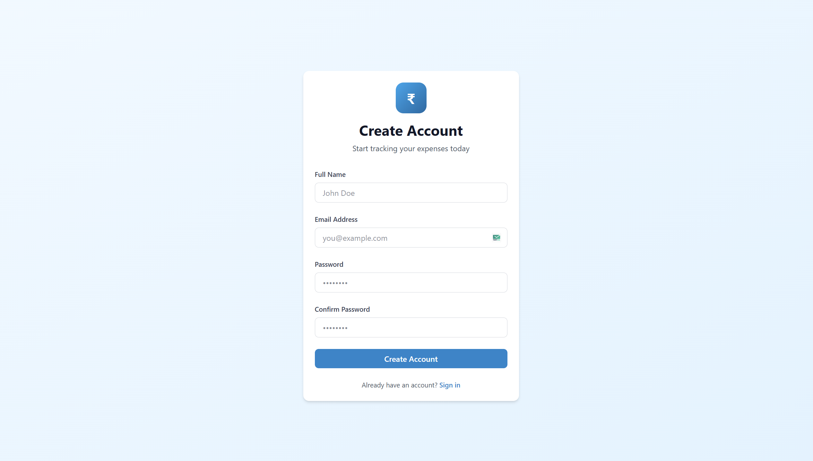
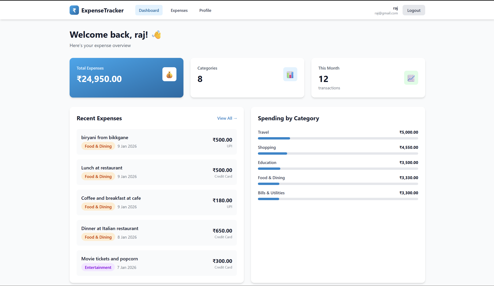
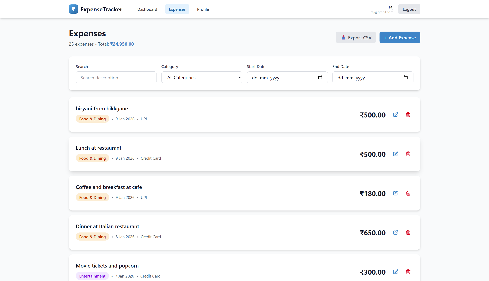

# 💰 Expense Tracker - Full Stack Application

A modern expense tracking application with **React.js frontend** and **Node.js backend**, featuring JWT authentication and complete CRUD operations.

  

---

## 📦 Deliverables

✅ **Frontend (React) + Backend (Node.js)** - Hosted in GitHub repository  
✅ **Functional Authentication** - Register/Login/Logout with JWT  
✅ **Dashboard with CRUD** - Full expense management system  
✅ **API Documentation** - Postman collection included  
✅ **Scalability Notes** - Production deployment strategy  

---

## 📸 UI Screenshots

### Login Page


### Signup Page


### Dashboard


### Expenses Management


### User Profile


---

## 🚀 Quick Start

### Prerequisites
- Node.js v16+
- MongoDB running locally or Atlas account

### Installation

```bash
# 1. Backend Setup
cd backend
npm install
npm start          # Runs on http://localhost:5000

# 2. Frontend Setup (new terminal)
cd frontend
npm install
npm run dev        # Runs on http://localhost:3000
```

### Environment Setup

Create `backend/.env`:
```env
PORT=5000
MONGODB_URI=mongodb://localhost:27017/expense-tracker
JWT_SECRET=your_secret_key_here
JWT_EXPIRE=7d
```

---

## 🎯 Core Features

### Authentication (JWT-based)
- User registration with password hashing (bcrypt)
- Secure login with JWT token generation
- Protected routes with authentication middleware
- Logout functionality

### Dashboard
- Real-time expense statistics
- Category-wise breakdown
- Monthly spending trends
- Total expenses and count

### CRUD Operations (Expenses)
- ✅ **Create** - Add new expenses with validation
- ✅ **Read** - View all expenses with advanced filters
- ✅ **Update** - Edit existing expenses
- ✅ **Delete** - Remove expenses with confirmation

### Advanced Features
- Search by description
- Filter by category, date range, amount
- CSV export functionality
- Responsive design (mobile/tablet/desktop)

---

## 📁 Project Structure

```
Assignment/
├── backend/
│   ├── config/db.js           # MongoDB connection
│   ├── middleware/auth.js     # JWT authentication
│   ├── models/
│   │   ├── User.js            # User model
│   │   └── Expense.js         # Expense model
│   ├── routes/
│   │   ├── auth.js            # Auth endpoints
│   │   ├── users.js           # User profile
│   │   └── expenses.js        # Expense CRUD
│   └── server.js              # Express server
│
├── frontend/
│   ├── src/
│   │   ├── components/        # Reusable components
│   │   ├── contexts/          # Auth context
│   │   ├── pages/             # Login, Dashboard, Expenses
│   │   └── services/api.js    # Axios with JWT interceptors
│   └── vite.config.js
│
└── Postman_Collection.json    # API testing
```

---

## 🔌 API Endpoints

### Authentication
```
POST   /api/auth/register    # Register new user
POST   /api/auth/login       # Login user
GET    /api/auth/me          # Get current user (protected)
```

### User Profile
```
GET    /api/users/profile    # Get profile (protected)
PUT    /api/users/profile    # Update profile (protected)
```

### Expenses (All Protected)
```
GET    /api/expenses         # Get all expenses (with filters)
POST   /api/expenses         # Create expense
GET    /api/expenses/:id     # Get single expense
PUT    /api/expenses/:id     # Update expense
DELETE /api/expenses/:id     # Delete expense
GET    /api/expenses/stats   # Get statistics
```

**Query Parameters for Filtering:**
- `search` - Search in description
- `category` - Filter by category
- `startDate` / `endDate` - Date range
- `minAmount` / `maxAmount` - Amount range

---


## 🔒 Security Features

- **Password Hashing**: bcrypt with 10 salt rounds
- **JWT Tokens**: Secure authentication with 7-day expiration
- **Protected Routes**: Middleware ensures authenticated access
- **Authorization**: Users can only access their own data
- **Input Validation**: Client-side and server-side validation
- **CORS**: Configured for frontend-backend communication

---

## 📈 Scalability for Production


### Frontend Scalability
- **Code Splitting**: Lazy load routes to reduce bundle size by 60-70%
- **State Management**: Implement Redux Toolkit or React Query for caching
- **CDN Deployment**: Deploy to Vercel/Netlify with CloudFlare CDN
- **PWA Features**: Service workers for offline support
- **Performance**: Virtualization for large lists, debounced search

### Backend Scalability
- **Horizontal Scaling**: PM2 cluster mode + Load balancer (Nginx/AWS ALB)
- **Caching Layer**: Redis for frequently accessed data (90% query reduction)
- **Database Optimization**: 
  - Compound indexes on `userId`, `date`, `category`
  - Read replicas for scaling reads
  - Aggregation pipelines for statistics
- **Rate Limiting**: Prevent abuse (100 requests/15min)
- **Message Queues**: Bull/RabbitMQ for async tasks (CSV imports, emails)

### Deployment Architecture
```
CloudFlare CDN → Vercel (Frontend)
                      ↓
              AWS ALB (Load Balancer)
                      ↓
        Node.js Instances (3+) with PM2
                      ↓
    MongoDB Replica Set + Redis Cache
```

### Performance Targets
- API Response: < 200ms (p95)
- Page Load: < 2 seconds
- Uptime: 99.9%
- Concurrent Users: 10,000+

### Production Checklist
- [ ] Environment variables secured
- [ ] Database indexes created
- [ ] Redis caching implemented
- [ ] Rate limiting enabled
- [ ] Error monitoring (Sentry)
- [ ] CDN for static assets
- [ ] HTTPS enforced
- [ ] Backup strategy in place

---

## 🛠️ Tech Stack

**Frontend:** React 18, Vite, TailwindCSS, React Router, Axios  
**Backend:** Node.js, Express, MongoDB, Mongoose, JWT, bcrypt  
**Tools:** Postman, Git, npm

---

## 📝 Assignment Completion

| Requirement | Status | Implementation |
|-------------|--------|----------------|
| Frontend (React) | ✅ | React 18 + Vite + TailwindCSS |
| Backend (Node.js) | ✅ | Express + MongoDB + Mongoose |
| Authentication | ✅ | JWT with bcrypt password hashing |
| Dashboard | ✅ | Statistics, charts, filters |
| CRUD Operations | ✅ | Full expense management |
| API Documentation | ✅ | Postman collection included |
| Scalability Notes | ✅ | Comprehensive guide in SCALABILITY.md |

---

## 📧 Contact

**Developer:** Raj Kadam  
**Date:** January 2026  
**Repository:** [GitHub Link](https://github.com/rajkadam16/Assignment)
**Email:** kadamraj623@gmail.com
**Phone:** 9876543210
**Portfolio:** [Portfolio](https://raj-kadam-portfolio.vercel.app/)

---

<div align="center">
  <strong>Ready for Evaluation! 🚀</strong>
</div>
